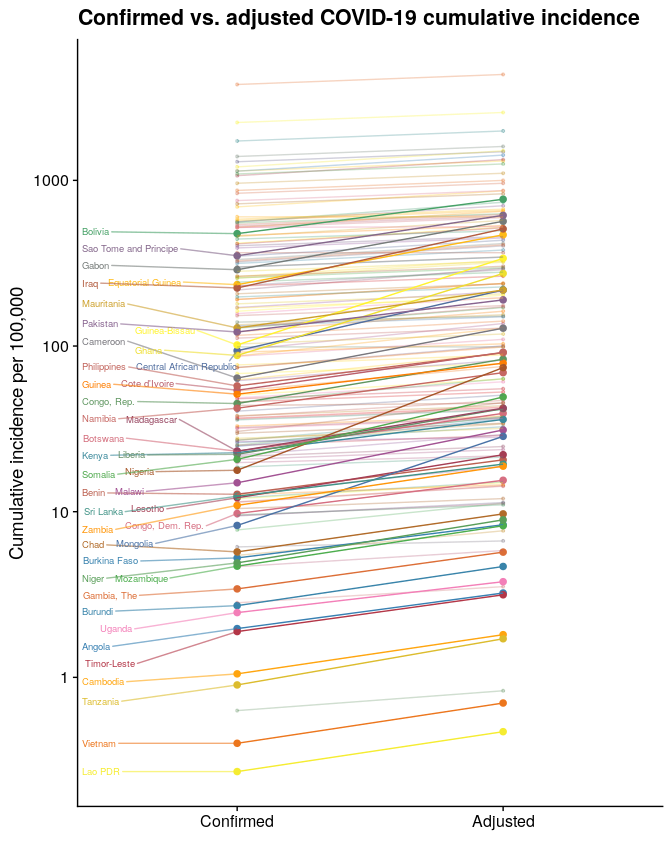

<!-- README.md is generated from README.Rmd. Please edit that file -->

# Estimating COVID-19 underreporting using TB case detection rates

Manuscript at:
<https://docs.google.com/document/d/1yC1M4ifLSp3XoLeWSoyNLABcUnuV9U-77NnFtzumdzQ/edit>

``` r
library(dplyr)
library(readr)
library(ggplot2)
library(tidyr)
library(cowplot)
theme_set(theme_cowplot())
options(scipen = '999')
# Get WHO CDR data
who <- read_csv('data/API_SH.TBS.DTEC.ZS_DS2_en_csv_v2_895250.csv', skip = 3) %>%
  dplyr::select(country = `Country Name`, iso = `Country Code`, cdr = `2018`) %>%
  filter(!is.na(cdr))

# Get the pop data
world_pop <- read_csv('data/world_pop.csv') %>% filter(!is.na(pop))

# Get JHU COVID data
jhu <- read_csv('data/jhu.csv')
# Get most recent date
most_recent <- jhu %>% filter(date >= (Sys.Date() - 7)) %>% group_by(country) %>% summarise(d = max(date)) %>%
  ungroup %>% summarise(d = min(d)) %>% .$d
covid <- jhu %>% filter(date == most_recent)

# Join
joined <- 
  covid %>% dplyr::select(iso, deaths, cases) %>%
  left_join(who %>% dplyr::select(iso, cdr)) %>%
  left_join(world_pop %>% dplyr::select(iso, pop, region, sub_region)) %>%
  filter(!is.na(region)) %>%
  filter(region != 'Oceania') %>%
  mutate(y = cases / pop * 100000)

cols <- colorRampPalette(RColorBrewer::brewer.pal(n = 8, name = 'Set1'))(length(unique(joined$region)))
fit <- lm(log(y) ~ cdr, data = joined)
ggplot(data = joined,
       aes(x = cdr,
           y = y)) +
  # facet_wrap(~region, scales = 'free') +
  scale_y_log10() +
  # scale_x_log10() +
  geom_jitter(aes(#color = region,
                  pch = region),
              size = 3,
              width = 5,
              height = 0.1,
              alpha = 0.8) +
  geom_smooth(#method = 'lm',
              # aes(group = region,
              #     color = region), 
              color = 'black',
              # formula = log(y) ~ x,
              method = 'lm',#  'gam',
              se = FALSE,
              lty = 2) +
  labs(x = 'TB case detection rate',
       y = 'Confirmed COVID-19 cases per 100,000 population',
       title = 'Association between TB Case detection rate and cumulative COVID-19 incidence') +
  scale_color_manual(name = '',
                     values = cols) +
  scale_shape_manual(name = '',
                     values = c(1,2, 5, 8)) +
  theme(legend.position = 'top')# +
```


``` r
  # stat_function(fun = function(x) predict(fit, newdata = data.frame(cdr=x)))
ggsave('fig1.png',
       width = 11,
       height = 6)
```

``` r
ggplot(data = joined,
       aes(x = cdr,
           y = y,
           group = region)) +
  facet_wrap(~region, scales = 'free') +
  scale_y_log10() +
  # scale_x_log10() +
  geom_jitter(aes(#color = region,
                  pch = region),
              size = 3,
              width = 5,
              height = 0.1,
              alpha = 0.8,
              show.legend = FALSE) +
  geom_smooth(#method = 'lm',
              # aes(group = region,
              #     color = region), 
              color = 'black',
              # formula = log(y) ~ x,
              method = 'lm',#  'gam',
              se = FALSE,
              lty = 2) +
  labs(x = 'TB case detection rate',
       y = 'Confirmed COVID-19 cases per 100,000 population',
       title = 'Association between TB Case detection rate and cumulative COVID-19 incidence') +
  # scale_color_manual(name = '',
  #                    values = cols) +
  scale_shape_manual(name = '',
                     values = c(1,2, 5, 8)) +
  theme(legend.position = 'top')# +
```


``` r
  # stat_function(fun = function(x) predict(fit, newdata = data.frame(cdr=x)))
ggsave('fig2.png',
       width = 11,
       height = 6)
```

# Make adjustment

``` r
out <- joined %>%
  left_join(world_pop %>% dplyr::select(iso, country)) %>%
  filter(!is.na(country)) %>%
  arrange(country) %>%
  mutate(adj = cases * (100/cdr)) %>%
    dplyr::mutate(ISO = iso, 
                  Region = region,
                  `Confirmed cases` = cases,
                  `Adjusted cases` = round(adj, digits = 1),
                  `TB CDR` = cdr,
                  `Confirmed cumulative incidence per 100,000` = round(cases / pop * 100000, digits = 2),
                  `Adjusted cumulative incidence per 100,000` = round(adj / pop * 100000,digits = 2)) %>%
  dplyr::select(ISO, Country = country, Region,`Confirmed cases`, `Adjusted cases`, `TB CDR`, `Confirmed cumulative incidence per 100,000`,`Adjusted cumulative incidence per 100,000`)
write_csv(out, 'adjustments.csv')
```

``` r
# Plots on left connected to lines on right plot
pd <- out %>%
  dplyr::select(Country, Region,
                `Confirmed cumulative incidence per 100,000`,
                `Adjusted cumulative incidence per 100,000`) %>%
  # Identify those with severe underestiamtes for labeling
  # mutate(severe = T) %>%
  filter(!Country %in% 'San Marino') %>%
  mutate(severe =
           (`Adjusted cumulative incidence per 100,000` >
              (1.5 * `Confirmed cumulative incidence per 100,000`)) &
           (`Adjusted cumulative incidence per 100,000` >=0)) %>%
  gather(key, value, `Confirmed cumulative incidence per 100,000`:`Adjusted cumulative incidence per 100,000`) %>%
  group_by(Country) %>%
  mutate(keep = n()) %>%
  ungroup %>%
  filter(keep == 2)
pd$key <- factor(pd$key,
                 levels = c('Confirmed cumulative incidence per 100,000',
                            'Adjusted cumulative incidence per 100,000'),
                 labels = c('Confirmed',
                            'Adjusted'))

# cols <- rainbow(length(unique(pd$Country)))
cols <- colorRampPalette(RColorBrewer::brewer.pal(n = 8, name = 'Set1'))(length(unique(pd$Country)))
cols <- sample(cols, length(cols))
library(ggrepel)
ggplot(data = pd,
        aes(x = key,
            y = value,
            group = Country,
            color = Country)) +
  geom_point(data = pd %>% filter(!severe), show.legend = FALSE, size = 0.8, alpha = 0.3) +
  geom_point(data = pd %>% filter(severe), show.legend = FALSE, size = 2, alpha = 1) +
  geom_line(data = pd %>% filter(!severe), alpha = 0.3) +
  geom_line(data = pd %>% filter(severe), alpha = 1) +
  scale_y_log10() +
  # facet_wrap(~Region,
  #            scales = 'free_y') +
  labs(x = '',
       y = 'Cumulative incidence per 100,000',
       title = 'Confirmed vs. adjusted COVID-19 cumulative incidence') +
  scale_color_manual(name = '', values = cols) +
  ggrepel::geom_text_repel(data = pd %>% filter(severe,
                                                 key == 'Confirmed'), 
                            aes(label = Country),
                            show.legend = FALSE,
            nudge_x = -1,
            hjust = 1,
            size = 2.5,
            segment.alpha = 0.6,
            # arrow = arrow(length = unit(0.02, "npc")),
            min.segment.length = 0) +
  theme(legend.position = 'none') 
```



``` r
ggsave('fig3.png',
       height = 11,
       width = 8)
```

``` r
knitr::kable(out)
```

| ISO | Country                        | Region   | Confirmed cases | Adjusted cases | TB CDR | Confirmed cumulative incidence per 100,000 | Adjusted cumulative incidence per 100,000 |
| :-- | :----------------------------- | :------- | --------------: | -------------: | -----: | -----------------------------------------: | ----------------------------------------: |
| AFG | Afghanistan                    | Asia     |           35070 |        50826.1 |     69 |                                      94.34 |                                    136.73 |
| ALB | Albania                        | Europe   |            3851 |         4426.4 |     87 |                                     134.35 |                                    154.43 |
| DZA | Algeria                        | Africa   |           21355 |        26693.8 |     80 |                                      50.57 |                                     63.21 |
| AND | Andorra                        | Europe   |             877 |         1008.0 |     87 |                                    1138.87 |                                   1309.05 |
| AGO | Angola                         | Africa   |             607 |          995.1 |     61 |                                       1.97 |                                      3.23 |
| ATG | Antigua and Barbuda            | Americas |              74 |           85.1 |     87 |                                      76.85 |                                     88.34 |
| ARG | Argentina                      | Americas |          114783 |       131934.5 |     87 |                                     257.97 |                                    296.52 |
| ARM | Armenia                        | Asia     |           33559 |        41948.8 |     80 |                                    1136.91 |                                   1421.14 |
| AUT | Austria                        | Europe   |           19270 |        26040.5 |     74 |                                     217.81 |                                    294.34 |
| AZE | Azerbaijan                     | Asia     |           26165 |        32706.2 |     80 |                                     263.17 |                                    328.96 |
| BHS | Bahamas, The                   | Americas |             124 |          142.5 |     87 |                                      32.15 |                                     36.96 |
| BHR | Bahrain                        | Asia     |           35084 |        40326.4 |     87 |                                    2235.45 |                                   2569.48 |
| BGD | Bangladesh                     | Asia     |          196323 |       261764.0 |     75 |                                     121.67 |                                    162.23 |
| BRB | Barbados                       | Americas |             104 |          119.5 |     87 |                                      36.28 |                                     41.70 |
| BLR | Belarus                        | Europe   |           65623 |        82028.8 |     80 |                                     691.83 |                                    864.79 |
| BEL | Belgium                        | Europe   |           63238 |        71861.4 |     88 |                                     553.65 |                                    629.14 |
| BLZ | Belize                         | Americas |              40 |           46.0 |     87 |                                      10.44 |                                     12.00 |
| BEN | Benin                          | Africa   |            1463 |         2359.7 |     62 |                                      12.74 |                                     20.55 |
| BTN | Bhutan                         | Asia     |              86 |          107.5 |     80 |                                      11.40 |                                     14.25 |
| BOL | Bolivia                        | Americas |           54156 |        87348.4 |     62 |                                     477.01 |                                    769.38 |
| BIH | Bosnia and Herzegovina         | Europe   |            7681 |         9601.2 |     80 |                                     231.08 |                                    288.85 |
| BWA | Botswana                       | Africa   |             522 |          884.7 |     59 |                                      23.16 |                                     39.25 |
| BRA | Brazil                         | Americas |         2012151 |      2312817.2 |     87 |                                     960.59 |                                   1104.13 |
| BRN | Brunei Darussalam              | Asia     |             141 |          162.1 |     87 |                                      32.87 |                                     37.78 |
| BGR | Bulgaria                       | Europe   |            8144 |         9931.7 |     82 |                                     115.94 |                                    141.39 |
| BFA | Burkina Faso                   | Africa   |            1038 |         1647.6 |     63 |                                       5.26 |                                      8.34 |
| BDI | Burundi                        | Africa   |             303 |          522.4 |     58 |                                       2.71 |                                      4.67 |
| CPV | Cabo Verde                     | Africa   |            1894 |         2367.5 |     80 |                                     348.31 |                                    435.39 |
| KHM | Cambodia                       | Asia     |             171 |          294.8 |     58 |                                       1.05 |                                      1.81 |
| CMR | Cameroon                       | Africa   |           16157 |        32314.0 |     50 |                                      64.07 |                                    128.15 |
| CAN | Canada                         | Americas |          111144 |       127751.7 |     87 |                                     299.91 |                                    344.73 |
| CAF | Central African Republic       | Africa   |            4373 |        10169.8 |     43 |                                      93.71 |                                    217.94 |
| TCD | Chad                           | Africa   |             886 |         1501.7 |     59 |                                       5.72 |                                      9.70 |
| CHL | Chile                          | Americas |          323698 |       372066.7 |     87 |                                    1728.31 |                                   1986.56 |
| CHN | China                          | Asia     |           85314 |        92732.6 |     92 |                                       6.13 |                                      6.66 |
| COL | Colombia                       | Americas |          165169 |       206461.2 |     80 |                                     332.68 |                                    415.84 |
| COM | Comoros                        | Africa   |             328 |             NA |     NA |                                      39.41 |                                        NA |
| COD | Congo, Dem. Rep.               | Africa   |            8199 |        13014.3 |     63 |                                       9.75 |                                     15.48 |
| COG | Congo, Rep.                    | Africa   |            2358 |         4366.7 |     54 |                                      44.96 |                                     83.26 |
| CRI | Costa Rica                     | Americas |            9546 |        11932.5 |     80 |                                     190.94 |                                    238.68 |
| CIV | Cote d’Ivoire                  | Africa   |           13554 |        22972.9 |     59 |                                      54.07 |                                     91.64 |
| HRV | Croatia                        | Europe   |            4039 |         4039.0 |    100 |                                      98.77 |                                     98.77 |
| CUB | Cuba                           | Americas |            2440 |         2804.6 |     87 |                                      21.52 |                                     24.74 |
| CYP | Cyprus                         | Asia     |            1031 |         1305.1 |     79 |                                      86.69 |                                    109.74 |
| CZE | Czech Republic                 | Europe   |           13612 |        18149.3 |     75 |                                     128.10 |                                    170.81 |
| DNK | Denmark                        | Europe   |           13325 |        15316.1 |     87 |                                     229.84 |                                    264.19 |
| DJI | Djibouti                       | Africa   |            4993 |         6241.2 |     80 |                                     520.69 |                                    650.86 |
| DMA | Dominica                       | Americas |              18 |           20.7 |     87 |                                      25.13 |                                     28.89 |
| DOM | Dominican Republic             | Americas |           48743 |        60928.8 |     80 |                                     458.66 |                                    573.33 |
| ECU | Ecuador                        | Americas |           71365 |        89206.2 |     80 |                                     417.72 |                                    522.15 |
| EGY | Egypt, Arab Rep.               | Africa   |           85771 |       126133.8 |     68 |                                      87.14 |                                    128.15 |
| SLV | El Salvador                    | Americas |           10957 |        13696.2 |     80 |                                     170.65 |                                    213.31 |
| GNQ | Equatorial Guinea              | Africa   |            3071 |         6142.0 |     50 |                                     234.61 |                                    469.22 |
| EST | Estonia                        | Europe   |            2016 |         2317.2 |     87 |                                     152.63 |                                    175.43 |
| ETH | Ethiopia                       | Africa   |            8475 |        12282.6 |     69 |                                       7.76 |                                     11.25 |
| FIN | Finland                        | Europe   |            7293 |         8287.5 |     88 |                                     132.17 |                                    150.19 |
| FRA | France                         | Europe   |          211102 |       254339.8 |     83 |                                     315.14 |                                    379.68 |
| GAB | Gabon                          | Africa   |            6121 |        12002.0 |     51 |                                     288.83 |                                    566.32 |
| GMB | Gambia, The                    | Africa   |              78 |          130.0 |     60 |                                       3.42 |                                      5.70 |
| GEO | Georgia                        | Asia     |            1006 |         1378.1 |     73 |                                      26.96 |                                     36.94 |
| DEU | Germany                        | Europe   |          201450 |       231551.7 |     87 |                                     242.92 |                                    279.22 |
| GHA | Ghana                          | Africa   |           26125 |        81640.6 |     32 |                                      87.76 |                                    274.26 |
| GRC | Greece                         | Europe   |            3939 |         4580.2 |     86 |                                      36.72 |                                     42.70 |
| GRD | Grenada                        | Americas |              23 |           26.4 |     87 |                                      20.64 |                                     23.72 |
| GTM | Guatemala                      | Americas |           32939 |        41173.8 |     80 |                                     190.98 |                                    238.72 |
| GIN | Guinea                         | Africa   |            6359 |         9783.1 |     65 |                                      51.22 |                                     78.80 |
| GNB | Guinea-Bissau                  | Africa   |            1902 |         6340.0 |     30 |                                     101.48 |                                    338.26 |
| GUY | Guyana                         | Americas |             315 |          393.8 |     80 |                                      40.44 |                                     50.55 |
| HTI | Haiti                          | Americas |            6948 |        10069.6 |     69 |                                      62.46 |                                     90.53 |
| HND | Honduras                       | Americas |           30867 |        38583.8 |     80 |                                     321.95 |                                    402.44 |
| HUN | Hungary                        | Europe   |            4279 |         4411.3 |     97 |                                      43.80 |                                     45.16 |
| ISL | Iceland                        | Europe   |            1914 |         2200.0 |     87 |                                     541.33 |                                    622.22 |
| IND | India                          | Asia     |         1003832 |      1356529.7 |     74 |                                      74.21 |                                    100.29 |
| IDN | Indonesia                      | Asia     |           81668 |       121892.5 |     67 |                                      30.51 |                                     45.54 |
| IRN | Iran, Islamic Rep.             | Asia     |          267061 |       333826.2 |     80 |                                     326.48 |                                    408.10 |
| IRQ | Iraq                           | Asia     |           86148 |       195790.9 |     44 |                                     224.15 |                                    509.43 |
| IRL | Ireland                        | Europe   |           25698 |        29537.9 |     87 |                                     529.47 |                                    608.59 |
| ISR | Israel                         | Asia     |           46059 |        52941.4 |     87 |                                     518.46 |                                    595.93 |
| ITA | Italy                          | Europe   |          243736 |       276972.7 |     88 |                                     403.33 |                                    458.33 |
| JAM | Jamaica                        | Americas |             765 |          956.2 |     80 |                                      26.07 |                                     32.58 |
| JPN | Japan                          | Asia     |           23510 |        27023.0 |     87 |                                      18.58 |                                     21.36 |
| JOR | Jordan                         | Asia     |            1206 |         1507.5 |     80 |                                      12.11 |                                     15.14 |
| KAZ | Kazakhstan                     | Asia     |           66895 |        66895.0 |    100 |                                     366.02 |                                    366.02 |
| KEN | Kenya                          | Africa   |           11673 |        18528.6 |     63 |                                      22.71 |                                     36.05 |
| KOR | Korea, Rep.                    | Asia     |           13672 |        14544.7 |     94 |                                      26.48 |                                     28.17 |
| KWT | Kuwait                         | Asia     |           57668 |        66285.1 |     87 |                                    1393.85 |                                   1602.13 |
| KGZ | Kyrgyz Republic                | Asia     |           12498 |        14365.5 |     87 |                                     197.88 |                                    227.45 |
| LAO | Lao PDR                        | Asia     |              19 |           33.3 |     57 |                                       0.27 |                                      0.47 |
| LVA | Latvia                         | Europe   |            1179 |             NA |     NA |                                      61.20 |                                        NA |
| LBN | Lebanon                        | Asia     |            2599 |         2987.4 |     87 |                                      37.95 |                                     43.62 |
| LSO | Lesotho                        | Africa   |             256 |          465.5 |     55 |                                      12.14 |                                     22.08 |
| LBR | Liberia                        | Africa   |            1070 |         2018.9 |     53 |                                      22.20 |                                     41.89 |
| LBY | Libya                          | Africa   |            1652 |         2429.4 |     68 |                                      24.74 |                                     36.38 |
| LIE | Liechtenstein                  | Europe   |              84 |             NA |     NA |                                     221.58 |                                        NA |
| LTU | Lithuania                      | Europe   |            1902 |         2186.2 |     87 |                                      68.18 |                                     78.37 |
| LUX | Luxembourg                     | Europe   |            5285 |         6074.7 |     87 |                                     869.63 |                                    999.58 |
| MDG | Madagascar                     | Africa   |            6089 |        11070.9 |     55 |                                      23.19 |                                     42.16 |
| MWI | Malawi                         | Africa   |            2712 |         5650.0 |     48 |                                      14.95 |                                     31.14 |
| MYS | Malaysia                       | Asia     |            8737 |        10042.5 |     87 |                                      27.71 |                                     31.85 |
| MDV | Maldives                       | Asia     |            2899 |         3623.8 |     80 |                                     562.15 |                                    702.69 |
| MLI | Mali                           | Africa   |            2440 |         3588.2 |     68 |                                      12.79 |                                     18.81 |
| MLT | Malta                          | Europe   |             674 |          732.6 |     92 |                                     139.39 |                                    151.51 |
| MRT | Mauritania                     | Africa   |            5659 |         9591.5 |     59 |                                     128.52 |                                    217.82 |
| MUS | Mauritius                      | Africa   |             343 |          428.8 |     80 |                                      27.11 |                                     33.89 |
| MEX | Mexico                         | Americas |          324041 |       405051.2 |     80 |                                     256.79 |                                    320.98 |
| MDA | Moldova                        | Europe   |           20264 |        23292.0 |     87 |                                     571.48 |                                    656.87 |
| MCO | Monaco                         | Europe   |             109 |             NA |     NA |                                     281.78 |                                        NA |
| MNG | Mongolia                       | Asia     |             262 |          903.4 |     29 |                                       8.26 |                                     28.50 |
| MNE | Montenegro                     | Europe   |            1287 |         1479.3 |     87 |                                     206.80 |                                    237.70 |
| MAR | Morocco                        | Africa   |           16545 |        19017.2 |     87 |                                      45.92 |                                     52.78 |
| MOZ | Mozambique                     | Africa   |            1383 |         2426.3 |     57 |                                       4.69 |                                      8.23 |
| MMR | Myanmar                        | Asia     |             339 |          446.1 |     76 |                                       0.63 |                                      0.83 |
| NAM | Namibia                        | Africa   |            1032 |         1691.8 |     61 |                                      42.15 |                                     69.10 |
| NPL | Nepal                          | Asia     |           17344 |        23125.3 |     75 |                                      61.75 |                                     82.33 |
| NLD | Netherlands                    | Europe   |           51572 |        59278.2 |     87 |                                     299.30 |                                    344.02 |
| NIC | Nicaragua                      | Americas |            3147 |         3933.8 |     80 |                                      48.67 |                                     60.84 |
| NER | Niger                          | Africa   |            1102 |         2003.6 |     55 |                                       4.91 |                                      8.93 |
| NGA | Nigeria                        | Africa   |           34854 |       145225.0 |     24 |                                      17.79 |                                     74.14 |
| MKD | North Macedonia                | Europe   |            8623 |        10778.8 |     80 |                                     413.98 |                                    517.47 |
| NOR | Norway                         | Europe   |            9015 |        10362.1 |     87 |                                     169.64 |                                    194.98 |
| OMN | Oman                           | Asia     |           62574 |        71924.1 |     87 |                                    1295.67 |                                   1489.27 |
| PAK | Pakistan                       | Asia     |          257914 |       402990.6 |     64 |                                     121.53 |                                    189.90 |
| PAN | Panama                         | Americas |           50373 |        62966.2 |     80 |                                    1206.00 |                                   1507.50 |
| PRY | Paraguay                       | Americas |            3342 |         3841.4 |     87 |                                      48.04 |                                     55.22 |
| PER | Peru                           | Americas |          341586 |       426982.5 |     80 |                                    1067.81 |                                   1334.77 |
| PHL | Philippines                    | Asia     |           61266 |        97247.6 |     63 |                                      57.44 |                                     91.18 |
| POL | Poland                         | Europe   |           39054 |        44889.7 |     87 |                                     102.83 |                                    118.20 |
| PRT | Portugal                       | Europe   |           47765 |        54902.3 |     87 |                                     464.56 |                                    533.98 |
| QAT | Qatar                          | Asia     |          105477 |       121237.9 |     87 |                                    3791.85 |                                   4358.45 |
| ROU | Romania                        | Europe   |           35003 |        40233.3 |     87 |                                     179.74 |                                    206.60 |
| RUS | Russian Federation             | Europe   |          751612 |       759204.0 |     99 |                                     520.23 |                                    525.48 |
| RWA | Rwanda                         | Africa   |            1473 |         1841.2 |     80 |                                      11.97 |                                     14.97 |
| SMR | San Marino                     | Europe   |             699 |             NA |     NA |                                    2068.97 |                                        NA |
| STP | Sao Tome and Principe          | Africa   |             740 |         1298.2 |     57 |                                     350.66 |                                    615.20 |
| SAU | Saudi Arabia                   | Asia     |          243238 |       279583.9 |     87 |                                     721.78 |                                    829.63 |
| SEN | Senegal                        | Africa   |            8481 |        11945.1 |     71 |                                      53.49 |                                     75.34 |
| SRB | Serbia                         | Europe   |           19717 |        22663.2 |     87 |                                     282.39 |                                    324.59 |
| SYC | Seychelles                     | Africa   |             108 |          124.1 |     87 |                                     111.61 |                                    128.29 |
| SLE | Sierra Leone                   | Africa   |            1678 |         2237.3 |     75 |                                      21.93 |                                     29.25 |
| SGP | Singapore                      | Asia     |           47126 |        54167.8 |     87 |                                     835.76 |                                    960.65 |
| SVK | Slovak Republic                | Europe   |            1951 |         2242.5 |     87 |                                      35.82 |                                     41.17 |
| SVN | Slovenia                       | Europe   |            1897 |         2131.5 |     89 |                                      91.76 |                                    103.10 |
| SOM | Somalia                        | Africa   |            3106 |         7395.2 |     42 |                                      20.70 |                                     49.27 |
| ZAF | South Africa                   | Africa   |          324221 |       426606.6 |     76 |                                     561.13 |                                    738.33 |
| SSD | South Sudan                    | Africa   |            2171 |         2385.7 |     91 |                                      19.78 |                                     21.74 |
| ESP | Spain                          | Europe   |          281511 |       281511.0 |    100 |                                     602.50 |                                    602.50 |
| LKA | Sri Lanka                      | Asia     |            2687 |         4198.4 |     64 |                                      12.40 |                                     19.37 |
| KNA | St. Kitts and Nevis            | Americas |              17 |             NA |     NA |                                      32.42 |                                        NA |
| LCA | St. Lucia                      | Americas |              23 |           26.4 |     87 |                                      12.65 |                                     14.53 |
| VCT | St. Vincent and the Grenadines | Americas |              35 |           40.2 |     87 |                                      31.76 |                                     36.50 |
| SDN | Sudan                          | Africa   |           10527 |        15711.9 |     67 |                                      25.18 |                                     37.59 |
| SUR | Suriname                       | Americas |             904 |         1130.0 |     80 |                                     156.95 |                                    196.18 |
| SWE | Sweden                         | Europe   |           76877 |        88364.4 |     87 |                                     754.94 |                                    867.75 |
| CHE | Switzerland                    | Europe   |           33290 |        38264.4 |     87 |                                     390.89 |                                    449.29 |
| SYR | Syrian Arab Republic           | Asia     |             477 |          596.2 |     80 |                                       2.82 |                                      3.53 |
| TJK | Tajikistan                     | Asia     |            6741 |         8988.0 |     75 |                                      74.07 |                                     98.76 |
| TZA | Tanzania                       | Africa   |             509 |          960.4 |     53 |                                       0.90 |                                      1.71 |
| THA | Thailand                       | Asia     |            3236 |         4045.0 |     80 |                                       4.66 |                                      5.83 |
| TLS | Timor-Leste                    | Asia     |              24 |           40.0 |     60 |                                       1.89 |                                      3.15 |
| TGO | Togo                           | Africa   |             749 |          881.2 |     85 |                                       9.49 |                                     11.17 |
| TTO | Trinidad and Tobago            | Americas |             133 |          152.9 |     87 |                                       9.57 |                                     11.00 |
| TUN | Tunisia                        | Africa   |            1327 |         1658.8 |     80 |                                      11.47 |                                     14.34 |
| TUR | Turkey                         | Asia     |          216873 |       249279.3 |     87 |                                     263.45 |                                    302.82 |
| UGA | Uganda                         | Africa   |            1051 |         1616.9 |     65 |                                       2.46 |                                      3.78 |
| UKR | Ukraine                        | Europe   |           57640 |        76853.3 |     75 |                                     129.17 |                                    172.23 |
| ARE | United Arab Emirates           | Asia     |           56129 |        64516.1 |     87 |                                     582.80 |                                    669.88 |
| GBR | United Kingdom                 | Europe   |          294116 |       330467.4 |     89 |                                     442.35 |                                    497.03 |
| USA | United States                  | Americas |         3576157 |      4110525.3 |     87 |                                    1093.07 |                                   1256.40 |
| URY | Uruguay                        | Americas |            1026 |         1179.3 |     87 |                                      29.75 |                                     34.19 |
| UZB | Uzbekistan                     | Asia     |           15066 |        20925.0 |     72 |                                      45.72 |                                     63.49 |
| VEN | Venezuela, RB                  | Americas |           10854 |        13567.5 |     80 |                                      37.60 |                                     46.99 |
| VNM | Vietnam                        | Asia     |             381 |          668.4 |     57 |                                       0.40 |                                      0.70 |
| PSE | West Bank and Gaza             | Asia     |            7412 |         9265.0 |     80 |                                     162.22 |                                    202.78 |
| YEM | Yemen, Rep.                    | Asia     |            1552 |         2185.9 |     71 |                                       5.45 |                                      7.67 |
| ZMB | Zambia                         | Africa   |            1895 |         3267.2 |     58 |                                      10.92 |                                     18.83 |
| ZWE | Zimbabwe                       | Africa   |            1362 |         1641.0 |     83 |                                       9.43 |                                     11.36 |
