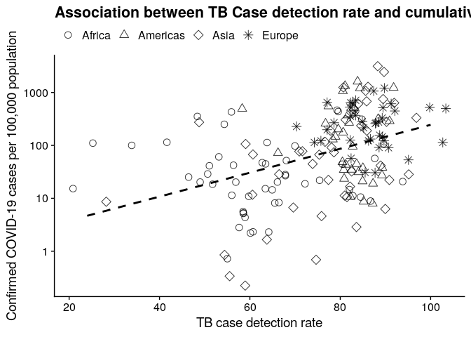
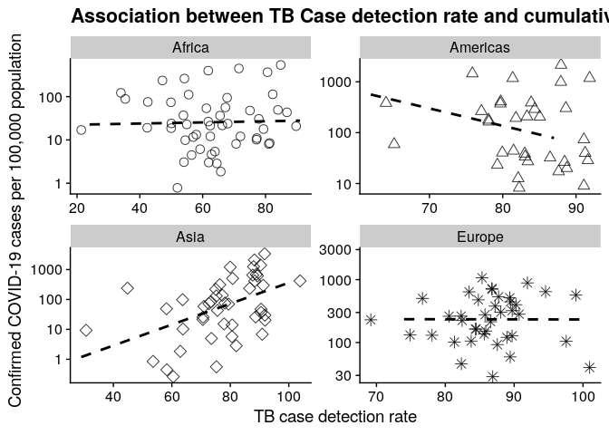

<!-- README.md is generated from README.Rmd. Please edit that file -->

# Estimating COVID-19 underreporting using TB case detection rates

Manuscript at:
<https://docs.google.com/document/d/1yC1M4ifLSp3XoLeWSoyNLABcUnuV9U-77NnFtzumdzQ/edit>

``` r
library(dplyr)
library(readr)
library(ggplot2)
library(tidyr)
library(cowplot)
theme_set(theme_cowplot())
options(scipen = '999')
# Get WHO CDR data
who <- read_csv('data/API_SH.TBS.DTEC.ZS_DS2_en_csv_v2_895250.csv', skip = 3) %>%
  dplyr::select(country = `Country Name`, iso = `Country Code`, cdr = `2018`) %>%
  filter(!is.na(cdr))

# Get the pop data
world_pop <- read_csv('data/world_pop.csv') %>% filter(!is.na(pop))

# Get JHU COVID data
jhu <- read_csv('data/jhu.csv')
# Get most recent date
most_recent <- jhu %>% filter(date >= (Sys.Date() - 7)) %>% group_by(country) %>% summarise(d = max(date)) %>%
  ungroup %>% summarise(d = min(d)) %>% .$d
covid <- jhu %>% filter(date == most_recent)

# Join
joined <- 
  covid %>% dplyr::select(iso, deaths, cases) %>%
  left_join(who %>% dplyr::select(iso, cdr)) %>%
  left_join(world_pop %>% dplyr::select(iso, pop, region, sub_region)) %>%
  filter(!is.na(region)) %>%
  filter(region != 'Oceania') %>%
  mutate(y = cases / pop * 100000)

cols <- colorRampPalette(RColorBrewer::brewer.pal(n = 8, name = 'Set1'))(length(unique(joined$region)))
fit <- lm(log(y) ~ cdr, data = joined)
ggplot(data = joined,
       aes(x = cdr,
           y = y)) +
  # facet_wrap(~region, scales = 'free') +
  scale_y_log10() +
  # scale_x_log10() +
  geom_jitter(aes(#color = region,
                  pch = region),
              size = 3,
              width = 5,
              height = 0.1,
              alpha = 0.8) +
  geom_smooth(#method = 'lm',
              # aes(group = region,
              #     color = region), 
              color = 'black',
              # formula = log(y) ~ x,
              method = 'lm',#  'gam',
              se = FALSE,
              lty = 2) +
  labs(x = 'TB case detection rate',
       y = 'Confirmed COVID-19 cases per 100,000 population',
       title = 'Association between TB Case detection rate and cumulative COVID-19 incidence') +
  scale_color_manual(name = '',
                     values = cols) +
  scale_shape_manual(name = '',
                     values = c(1,2, 5, 8)) +
  theme(legend.position = 'top')# +
```



``` r
  # stat_function(fun = function(x) predict(fit, newdata = data.frame(cdr=x)))
```

``` r
ggplot(data = joined,
       aes(x = cdr,
           y = y,
           group = region)) +
  facet_wrap(~region, scales = 'free') +
  scale_y_log10() +
  # scale_x_log10() +
  geom_jitter(aes(#color = region,
                  pch = region),
              size = 3,
              width = 5,
              height = 0.1,
              alpha = 0.8,
              show.legend = FALSE) +
  geom_smooth(#method = 'lm',
              # aes(group = region,
              #     color = region), 
              color = 'black',
              # formula = log(y) ~ x,
              method = 'lm',#  'gam',
              se = FALSE,
              lty = 2) +
  labs(x = 'TB case detection rate',
       y = 'Confirmed COVID-19 cases per 100,000 population',
       title = 'Association between TB Case detection rate and cumulative COVID-19 incidence') +
  # scale_color_manual(name = '',
  #                    values = cols) +
  scale_shape_manual(name = '',
                     values = c(1,2, 5, 8)) +
  theme(legend.position = 'top')# +
```



``` r
  # stat_function(fun = function(x) predict(fit, newdata = data.frame(cdr=x)))
```

# Make adjustment

``` r
out <- joined %>%
  mutate(adj = cases * (100/cdr)) %>%
    dplyr::mutate(ISO = iso, 
                  Region = region,
                  `Confirmed cases` = cases,
                  `Adjusted cases` = adj,
                  `TB CDR` = cdr,
                  `Confirmed cumulative incidence per 100,000` = round(cases / pop * 100000, digits = 2),
                  `Adjusted cumulative incidence per 100,000` = round(digits = 2)) %>%
  dplyr::select(ISO, Region,`Confirmed cases`, `Adjusted cases`, `TB CDR`, `Confirmed cumulative incidence per 100,000`,`Adjusted cumulative incidence per 100,000`)
write_csv(out, 'adjustments.csv')
knitr::kable(out)
```

| ISO | Region   | Confirmed cases | Adjusted cases | TB CDR | Confirmed cumulative incidence per 100,000 | Adjusted cumulative incidence per 100,000 |
| :-- | :------- | --------------: | -------------: | -----: | -----------------------------------------: | ----------------------------------------: |
| AFG | Asia     |             367 |     531.884058 |     69 |                                       0.99 |                                         2 |
| ALB | Europe   |             377 |     433.333333 |     87 |                                      13.15 |                                         2 |
| DZA | Africa   |            1423 |    1778.750000 |     80 |                                       3.37 |                                         2 |
| AND | Europe   |             525 |     603.448276 |     87 |                                     681.77 |                                         2 |
| AGO | Africa   |              16 |      26.229508 |     61 |                                       0.05 |                                         2 |
| ATG | Americas |              15 |      17.241379 |     87 |                                      15.58 |                                         2 |
| ARG | Americas |            1554 |    1786.206897 |     87 |                                       3.49 |                                         2 |
| ARM | Asia     |             833 |    1041.250000 |     80 |                                      28.22 |                                         2 |
| AUT | Europe   |           12297 |   16617.567568 |     74 |                                     139.00 |                                         2 |
| AZE | Asia     |             641 |     801.250000 |     80 |                                       6.45 |                                         2 |
| BHS | Americas |              29 |      33.333333 |     87 |                                       7.52 |                                         2 |
| BHR | Asia     |             756 |     868.965517 |     87 |                                      48.17 |                                         2 |
| BGD | Asia     |             123 |     164.000000 |     75 |                                       0.08 |                                         2 |
| BRB | Americas |              60 |      68.965517 |     87 |                                      20.93 |                                         2 |
| BLR | Europe   |             700 |     875.000000 |     80 |                                       7.38 |                                         2 |
| BEL | Europe   |           20814 |   23652.272727 |     88 |                                     182.23 |                                         2 |
| BLZ | Americas |               7 |       8.045977 |     87 |                                       1.83 |                                         2 |
| BEN | Africa   |              26 |      41.935484 |     62 |                                       0.23 |                                         2 |
| BTN | Asia     |               5 |       6.250000 |     80 |                                       0.66 |                                         2 |
| BOL | Americas |             183 |     295.161290 |     62 |                                       1.61 |                                         2 |
| BIH | Europe   |             674 |     842.500000 |     80 |                                      20.28 |                                         2 |
| BWA | Africa   |               6 |      10.169491 |     59 |                                       0.27 |                                         2 |
| BRA | Americas |           12161 |   13978.160920 |     87 |                                       5.81 |                                         2 |
| BRN | Asia     |             135 |     155.172414 |     87 |                                      31.47 |                                         2 |
| BGR | Europe   |             549 |     669.512195 |     82 |                                       7.82 |                                         2 |
| BFA | Africa   |             364 |     577.777778 |     63 |                                       1.84 |                                         2 |
| MMR | Asia     |              22 |      28.947368 |     76 |                                       0.04 |                                         2 |
| BDI | Africa   |               3 |       5.172414 |     58 |                                       0.03 |                                         2 |
| CPV | Africa   |               7 |       8.750000 |     80 |                                       1.29 |                                         2 |
| KHM | Asia     |             114 |     196.551724 |     58 |                                       0.70 |                                         2 |
| CMR | Africa   |             658 |    1316.000000 |     50 |                                       2.61 |                                         2 |
| CAN | Americas |           16563 |   19037.931035 |     87 |                                      44.69 |                                         2 |
| CAF | Africa   |               8 |      18.604651 |     43 |                                       0.17 |                                         2 |
| TCD | Africa   |               9 |      15.254237 |     59 |                                       0.06 |                                         2 |
| CHL | Americas |            4815 |    5534.482759 |     87 |                                      25.71 |                                         2 |
| CHN | Asia     |           82665 |   89853.260870 |     92 |                                       5.94 |                                         2 |
| COL | Americas |            1579 |    1973.750000 |     80 |                                       3.18 |                                         2 |
| COG | Africa   |              45 |      83.333333 |     54 |                                       0.86 |                                         2 |
| COD | Africa   |             161 |     255.555556 |     63 |                                       0.19 |                                         2 |
| CRI | Americas |             467 |     583.750000 |     80 |                                       9.34 |                                         2 |
| CIV | Africa   |             323 |     547.457627 |     59 |                                       1.29 |                                         2 |
| HRV | Europe   |            1222 |    1222.000000 |    100 |                                      29.88 |                                         2 |
| CUB | Americas |             350 |     402.298851 |     87 |                                       3.09 |                                         2 |
| CYP | Asia     |             465 |     588.607595 |     79 |                                      39.10 |                                         2 |
| CZE | Europe   |            4822 |    6429.333333 |     75 |                                      45.38 |                                         2 |
| DNK | Europe   |            4875 |    5603.448276 |     87 |                                      84.09 |                                         2 |
| DJI | Africa   |              90 |     112.500000 |     80 |                                       9.39 |                                         2 |
| DMA | Americas |              15 |      17.241379 |     87 |                                      20.94 |                                         2 |
| DOM | Americas |            1828 |    2285.000000 |     80 |                                      17.20 |                                         2 |
| ECU | Americas |            3747 |    4683.750000 |     80 |                                      21.93 |                                         2 |
| EGY | Africa   |            1322 |    1944.117647 |     68 |                                       1.34 |                                         2 |
| SLV | Americas |              69 |      86.250000 |     80 |                                       1.07 |                                         2 |
| GNQ | Africa   |              16 |      32.000000 |     50 |                                       1.22 |                                         2 |
| EST | Europe   |            1108 |    1273.563218 |     87 |                                      83.88 |                                         2 |
| ETH | Africa   |              44 |      63.768116 |     69 |                                       0.04 |                                         2 |
| FIN | Europe   |            2176 |    2472.727273 |     88 |                                      39.43 |                                         2 |
| FRA | Europe   |           98963 |  119232.530120 |     83 |                                     147.73 |                                         2 |
| GAB | Africa   |              24 |      47.058824 |     51 |                                       1.13 |                                         2 |
| GMB | Africa   |               4 |       6.666667 |     60 |                                       0.18 |                                         2 |
| GEO | Asia     |             188 |     257.534247 |     73 |                                       5.04 |                                         2 |
| DEU | Europe   |          103374 |  118820.689655 |     87 |                                     124.66 |                                         2 |
| GHA | Africa   |             214 |     668.750000 |     32 |                                       0.72 |                                         2 |
| GRC | Europe   |            1755 |    2040.697674 |     86 |                                      16.36 |                                         2 |
| GRD | Americas |              12 |      13.793103 |     87 |                                      10.77 |                                         2 |
| GTM | Americas |              70 |      87.500000 |     80 |                                       0.41 |                                         2 |
| GIN | Africa   |             128 |     196.923077 |     65 |                                       1.03 |                                         2 |
| GNB | Africa   |              18 |      60.000000 |     30 |                                       0.96 |                                         2 |
| GUY | Americas |              31 |      38.750000 |     80 |                                       3.98 |                                         2 |
| HTI | Americas |              24 |      34.782609 |     69 |                                       0.22 |                                         2 |
| HND | Americas |             298 |     372.500000 |     80 |                                       3.11 |                                         2 |
| HUN | Europe   |             744 |     767.010309 |     97 |                                       7.62 |                                         2 |
| ISL | Europe   |            1562 |    1795.402299 |     87 |                                     441.77 |                                         2 |
| IND | Asia     |            4778 |    6456.756757 |     74 |                                       0.35 |                                         2 |
| IDN | Asia     |            2491 |    3717.910448 |     67 |                                       0.93 |                                         2 |
| IRN | Asia     |           60500 |   75625.000000 |     80 |                                      73.96 |                                         2 |
| IRQ | Asia     |            1031 |    2343.181818 |     44 |                                       2.68 |                                         2 |
| IRL | Europe   |            5364 |    6165.517241 |     87 |                                     110.52 |                                         2 |
| ISR | Asia     |            8904 |   10234.482759 |     87 |                                     100.23 |                                         2 |
| ITA | Europe   |          132547 |  150621.590909 |     88 |                                     219.34 |                                         2 |
| JAM | Americas |              58 |      72.500000 |     80 |                                       1.98 |                                         2 |
| JPN | Asia     |            3654 |    4200.000000 |     87 |                                       2.89 |                                         2 |
| JOR | Asia     |             349 |     436.250000 |     80 |                                       3.51 |                                         2 |
| KAZ | Asia     |             662 |     662.000000 |    100 |                                       3.62 |                                         2 |
| KEN | Africa   |             158 |     250.793651 |     63 |                                       0.31 |                                         2 |
| KWT | Asia     |             665 |     764.367816 |     87 |                                      16.07 |                                         2 |
| KGZ | Asia     |             216 |     248.275862 |     87 |                                       3.42 |                                         2 |
| LAO | Asia     |              12 |      21.052632 |     57 |                                       0.17 |                                         2 |
| LVA | Europe   |             542 |             NA |     NA |                                      28.13 |                                         2 |
| LBN | Asia     |             541 |     621.839081 |     87 |                                       7.90 |                                         2 |
| LBR | Africa   |              14 |      26.415094 |     53 |                                       0.29 |                                         2 |
| LBY | Africa   |              19 |      27.941177 |     68 |                                       0.28 |                                         2 |
| LIE | Europe   |              77 |             NA |     NA |                                     203.11 |                                         2 |
| LTU | Europe   |             843 |     968.965517 |     87 |                                      30.22 |                                         2 |
| LUX | Europe   |            2843 |    3267.816092 |     87 |                                     467.81 |                                         2 |
| MDG | Africa   |              82 |     149.090909 |     55 |                                       0.31 |                                         2 |
| MWI | Africa   |               5 |      10.416667 |     48 |                                       0.03 |                                         2 |
| MYS | Asia     |            3793 |    4359.770115 |     87 |                                      12.03 |                                         2 |
| MDV | Asia     |              19 |      23.750000 |     80 |                                       3.68 |                                         2 |
| MLI | Africa   |              47 |      69.117647 |     68 |                                       0.25 |                                         2 |
| MLT | Europe   |             241 |     261.956522 |     92 |                                      49.84 |                                         2 |
| MRT | Africa   |               6 |      10.169491 |     59 |                                       0.14 |                                         2 |
| MUS | Africa   |             244 |     305.000000 |     80 |                                      19.28 |                                         2 |
| MEX | Americas |            2143 |    2678.750000 |     80 |                                       1.70 |                                         2 |
| MDA | Europe   |             965 |    1109.195402 |     87 |                                      27.21 |                                         2 |
| MCO | Europe   |              77 |             NA |     NA |                                     199.06 |                                         2 |
| MNG | Asia     |              15 |      51.724138 |     29 |                                       0.47 |                                         2 |
| MNE | Europe   |             233 |     267.816092 |     87 |                                      37.44 |                                         2 |
| MAR | Africa   |            1120 |    1287.356322 |     87 |                                       3.11 |                                         2 |
| MOZ | Africa   |              10 |      17.543860 |     57 |                                       0.03 |                                         2 |
| NAM | Africa   |              16 |      26.229508 |     61 |                                       0.65 |                                         2 |
| NPL | Asia     |               9 |      12.000000 |     75 |                                       0.03 |                                         2 |
| NLD | Europe   |           18926 |   21754.022989 |     87 |                                     109.84 |                                         2 |
| NIC | Americas |               6 |       7.500000 |     80 |                                       0.09 |                                         2 |
| NER | Africa   |             253 |     460.000000 |     55 |                                       1.13 |                                         2 |
| NGA | Africa   |             238 |     991.666667 |     24 |                                       0.12 |                                         2 |
| MKD | Europe   |             570 |     712.500000 |     80 |                                      27.36 |                                         2 |
| NOR | Europe   |            5865 |    6741.379310 |     87 |                                     110.36 |                                         2 |
| OMN | Asia     |             331 |     380.459770 |     87 |                                       6.85 |                                         2 |
| PAK | Asia     |            3766 |    5884.375000 |     64 |                                       1.77 |                                         2 |
| PAN | Americas |            1988 |    2485.000000 |     80 |                                      47.60 |                                         2 |
| PRY | Americas |             113 |     129.885057 |     87 |                                       1.62 |                                         2 |
| PER | Americas |            2561 |    3201.250000 |     80 |                                       8.01 |                                         2 |
| PHL | Asia     |            3660 |    5809.523810 |     63 |                                       3.43 |                                         2 |
| POL | Europe   |            4413 |    5072.413793 |     87 |                                      11.62 |                                         2 |
| PRT | Europe   |           11730 |   13482.758621 |     87 |                                     114.09 |                                         2 |
| QAT | Asia     |            1832 |    2105.747126 |     87 |                                      65.86 |                                         2 |
| ROU | Europe   |            4057 |    4663.218391 |     87 |                                      20.83 |                                         2 |
| RUS | Europe   |            6343 |    6407.070707 |     99 |                                       4.39 |                                         2 |
| RWA | Africa   |             105 |     131.250000 |     80 |                                       0.85 |                                         2 |
| KNA | Americas |              10 |             NA |     NA |                                      19.07 |                                         2 |
| LCA | Americas |              14 |      16.091954 |     87 |                                       7.70 |                                         2 |
| VCT | Americas |               7 |       8.045977 |     87 |                                       6.35 |                                         2 |
| SMR | Europe   |             266 |             NA |     NA |                                     787.33 |                                         2 |
| STP | Africa   |               4 |       7.017544 |     57 |                                       1.90 |                                         2 |
| SAU | Asia     |            2605 |    2994.252874 |     87 |                                       7.73 |                                         2 |
| SEN | Africa   |             226 |     318.309859 |     71 |                                       1.43 |                                         2 |
| SRB | Europe   |            2200 |    2528.735632 |     87 |                                      31.51 |                                         2 |
| SYC | Africa   |              11 |      12.643678 |     87 |                                      11.37 |                                         2 |
| SLE | Africa   |               6 |       8.000000 |     75 |                                       0.08 |                                         2 |
| SGP | Asia     |            1375 |    1580.459770 |     87 |                                      24.39 |                                         2 |
| SVK | Europe   |             534 |     613.793103 |     87 |                                       9.80 |                                         2 |
| SVN | Europe   |            1021 |    1147.191011 |     89 |                                      49.39 |                                         2 |
| SOM | Africa   |               7 |      16.666667 |     42 |                                       0.05 |                                         2 |
| ZAF | Africa   |            1686 |    2218.421053 |     76 |                                       2.92 |                                         2 |
| KOR | Asia     |           10284 |   10940.425532 |     94 |                                      19.92 |                                         2 |
| SSD | Africa   |               1 |       1.098901 |     91 |                                       0.01 |                                         2 |
| ESP | Europe   |          140511 |  140511.000000 |    100 |                                     300.73 |                                         2 |
| LKA | Asia     |             178 |     278.125000 |     64 |                                       0.82 |                                         2 |
| SDN | Africa   |              12 |      17.910448 |     67 |                                       0.03 |                                         2 |
| SUR | Americas |              10 |      12.500000 |     80 |                                       1.74 |                                         2 |
| SWE | Europe   |            7206 |    8282.758621 |     87 |                                      70.76 |                                         2 |
| CHE | Europe   |           21657 |   24893.103448 |     87 |                                     254.29 |                                         2 |
| SYR | Asia     |              19 |      23.750000 |     80 |                                       0.11 |                                         2 |
| TZA | Africa   |              24 |      45.283019 |     53 |                                       0.04 |                                         2 |
| THA | Asia     |            2220 |    2775.000000 |     80 |                                       3.20 |                                         2 |
| TLS | Asia     |               1 |       1.666667 |     60 |                                       0.08 |                                         2 |
| TGO | Africa   |              58 |      68.235294 |     85 |                                       0.74 |                                         2 |
| TTO | Americas |             105 |     120.689655 |     87 |                                       7.55 |                                         2 |
| TUN | Africa   |             596 |     745.000000 |     80 |                                       5.15 |                                         2 |
| TUR | Asia     |           30217 |   34732.183908 |     87 |                                      36.71 |                                         2 |
| UGA | Africa   |              52 |      80.000000 |     65 |                                       0.12 |                                         2 |
| UKR | Europe   |            1319 |    1758.666667 |     75 |                                       2.96 |                                         2 |
| ARE | Asia     |            2076 |    2386.206897 |     87 |                                      21.56 |                                         2 |
| GBR | Europe   |           52279 |   58740.449438 |     89 |                                      78.63 |                                         2 |
| URY | Americas |             406 |     466.666667 |     87 |                                      11.77 |                                         2 |
| USA | Americas |          366614 |  421395.402299 |     87 |                                     112.06 |                                         2 |
| UZB | Asia     |             457 |     634.722222 |     72 |                                       1.39 |                                         2 |
| VEN | Americas |             165 |     206.250000 |     80 |                                       0.57 |                                         2 |
| VNM | Asia     |             245 |     429.824561 |     57 |                                       0.26 |                                         2 |
| PSE | Asia     |             254 |     317.500000 |     80 |                                       5.56 |                                         2 |
| ZMB | Africa   |              39 |      67.241379 |     58 |                                       0.22 |                                         2 |
| ZWE | Africa   |              10 |      12.048193 |     83 |                                       0.07 |                                         2 |
